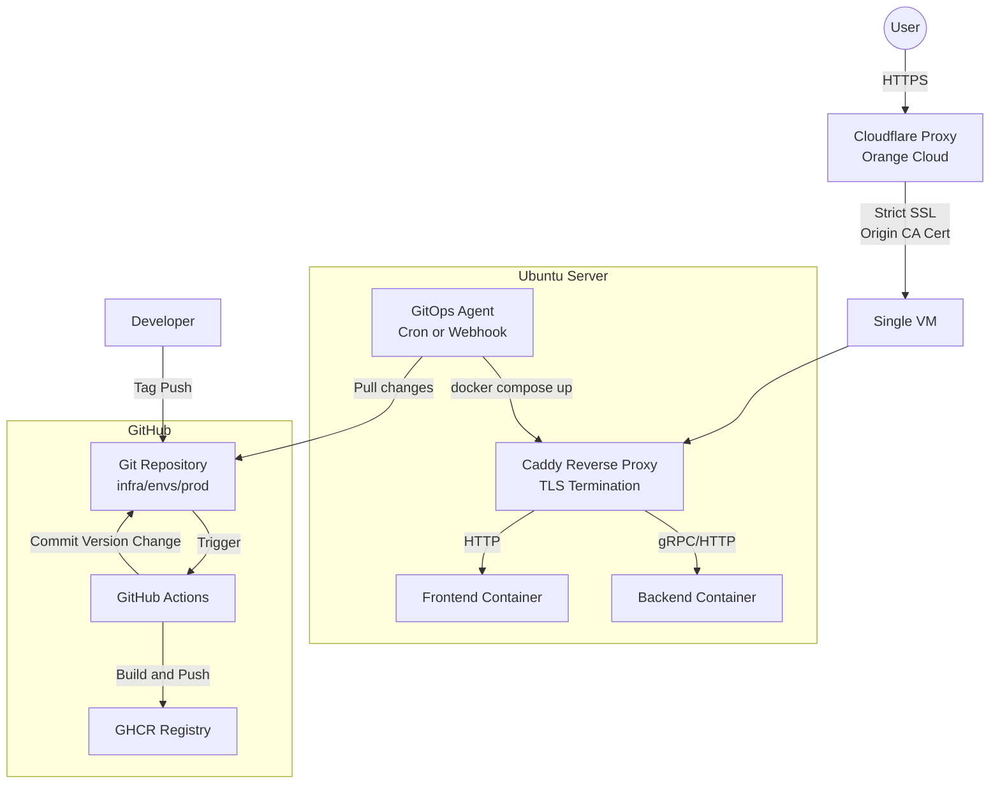

```mermaid
graph TD
    User((User)) -->|HTTPS| CF[Cloudflare Proxy\nOrange Cloud]
    CF -->|Strict SSL\nOrigin CA Cert| VMNode[Single VM]

    subgraph VM_SG [Ubuntu Server]
        Caddy[Caddy Reverse Proxy\nTLS Termination]
        Fe[Frontend Container]
        Be[Backend Container]
        GitAgent[GitOps Agent\nCron or Webhook]

        Caddy -->|HTTP| Fe
        Caddy -->|gRPC/HTTP| Be
    end

    VMNode --> Caddy

    subgraph GitHub
        Repo[Git Repository\ninfra/envs/prod]
        GHCR[GHCR Registry]
        Action[GitHub Actions]
    end

    Dev[Developer] -->|Tag Push| Repo
    Repo -->|Trigger| Action
    Action -->|Build and Push| GHCR
    Action -->|Commit Version Change| Repo

    GitAgent -->|Pull changes| Repo
    GitAgent -->|docker compose up| Caddy

```