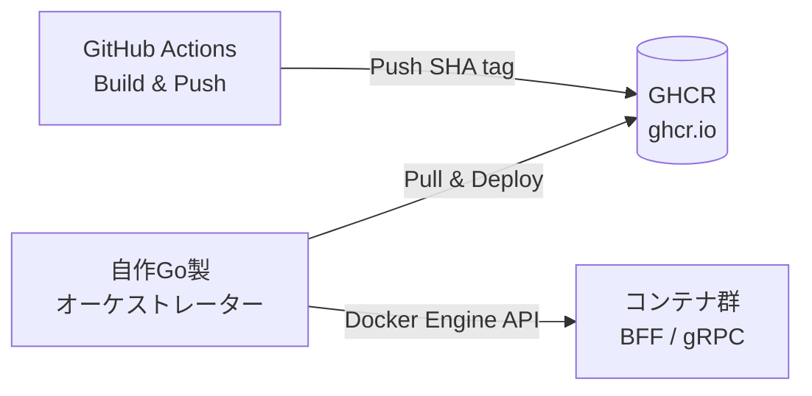

# hss-science System Architecture & AI Guidelines

本ドキュメントは、hss-scienceシステムの全体アーキテクチャ、インフラストラクチャ、および実装上の原則を定義したものです。
AIエージェントによるコード生成およびリファクタリングは、この基本思想に準拠しつつも、**形式に縛られず、常に「最も合理的で美しい設計」を自律的に追求してください。**

## 1. 基本思想と The Twelve-Factor App (Core Philosophy)

本システムは、大規模化とチーム開発を見据え、**「関心の分離（Separation of Concerns）」**と**「The Twelve-Factor App」**を設計の根底に置きます。AIエージェントはこれらを遵守し、過剰な抽象化（重厚なORMや無意味なレイヤー分け）を避けて実装してください。

* **Stateless Processes (12-Factor: VI):** すべてのアプリケーションプロセス（特にBFF）はステートレスとし、共有・永続化すべきデータはすべてDB（Accounts / 各Domain）に保存します。
* **Config in Environment (12-Factor: III):** 認証情報、DB接続情報、環境差異はすべて環境変数で吸収し、コードへのハードコードは厳禁です。
* `ENV` (`development`, `staging`, `production`), `PORT`, `LOG_LEVEL` などを `.env.example` に一覧化すること。
* 起動時に環境変数をパースし、不足時は Fail-Fast (`fmt.Fprintf(os.Stderr, ...)` + `os.Exit(1)`) で即時終了させてください。


* **Disposability (12-Factor: IX):** コンテナの高速な起動と、SIGTERM受信時のグレースフルシャットダウンを徹底してください。
* **Logs as Event Streams (12-Factor: XI):** 構造化ロギングを徹底します。
* Go標準の `log/slog` を使用し、出力先は常に標準出力 (`os.Stdout`) とすること。
* フォーマットは JSON を基本とします（`ENV=development` 時のみ Text 形式へのフォールバック可）。
* ログには必ずコンテキスト（`service`名、`trace_id` または `request_id`）を含め、リクエストの追跡を可能にしてください。


## 2. 疎結合とルーティングの境界 【絶対制約】

システムが大規模化しても独立して開発できるよう、コンポーネント間の境界線を厳格に守ります。

* **Reverse Proxy (Caddy):** 最前面のTLS終端とルーティングを担います。
* `/*` (ルート配下): フロントエンドのSPA（Viteビルドの静的ファイル）を配信。
* `/api/*`: 各サブドメイン（`drive.hss-science.org`, `chat...`）に対応する BFF へリバースプロキシ。


* **BFF (Custom HTTP Server):**
* **責務:** HTTPリクエスト/レスポンス、CORS、リダイレクト、Cookieベースのセッション管理。
* **制約:** `grpc-gateway` は不使用。DBへの直接アクセスは厳禁。


* **Microservices (gRPC - `accounts`, `drive`, `chat`等):**
* **責務:** 純粋なドメインロジックの実行とデータ永続化。
* **制約:** HTTPやCookieの概念を一切持たせない。認証情報（`internal_user_id`）はContext経由で受け取る。


## 3. インフラストラクチャとデプロイメント (Infrastructure & Deployment)

一般的な Kubernetes や Docker Compose は採用せず、**自作の Go 製コンテナオーケストレーター** を使用して Docker Engine API を直接操作し、シンプルかつ完全にコントロール可能な運用を実現します。

* **イメージ管理:** マルチステージビルドを活用し、イメージレジストリは GHCR (GitHub Packages) を使用します。
* **タグ戦略:** イメージタグは Git の SHA ハッシュを基本とし、`latest` タグは明示的なデプロイ指示時にのみ更新します。



## 4. スキーマ駆動開発と契約 (Schema-Driven Development) 【絶対制約】

各コンポーネントが互いの内部実装に依存せず、「契約（スキーマ）」のみに依存して開発・テストできる状態を作ります。

* **外部向けAPI (Frontend ⇔ BFF):** `api/openapi/` に **OpenAPI (YAML)** を定義し、`oapi-codegen` 等で自律的にGoのコード生成を行うことを推奨します。
* **内部向け通信 (BFF ⇔ Microservices):** `api/proto/` に **Protocol Buffers** を定義し、`buf generate` 等でgRPCコードを生成します。HTTPアノテーション（`google.api.http`）は記述しません。

**※ AI Agentへの指示:**
スキーマを定義・変更した際は、必ず最初にコード生成コマンドを自律的に実行し、生成されたインターフェースを満たすように実装を進めてください。

## 5. テスト戦略 (Testing Strategy for Decoupled Systems)

システムのスケール時に依存地獄を避けるため、**ローカルでの全サービス連動型 E2E テスト（大規模な docker-compose up 等）は固く禁止します。** テストは各層で完結させることを原則とします。

```text
        ┌───────────┐
        │  手動検証  │  ← 本番/ステージング環境でのスモークテスト
       ─┴───────────┴─
      ┌─────────────────┐
      │ Integration Test │  ← testcontainers等でDB/外部依存を含む限定テスト
     ─┴─────────────────┴─
    ┌───────────────────────┐
    │       Unit Test       │  ← モック/スタブを活用した高速なテスト（主軸）
    └───────────────────────┘

```

* **禁止事項:** テスト用の共有データベースへの依存や、テスト間の実行順序依存を排除し、各テストが完全に独立して実行可能である状態を保ってください。BFF層はバックエンドのモックを用い、Microservices層はBFFの存在を気にせずテストします。

## 6. データマネジメント

* **Database per Service:** 各gRPCサービスは完全に独立したPostgreSQLデータベース（またはスキーマ）を持ちます。他サービスのDBへの直接アクセスやJOINは厳禁です。
* **柔軟な技術選定:** 重厚なORM（GORM等）は基本避けます。`database/sql` と `sqlx` をベースとしつつ、AIの判断でより型安全なツール（例: `sqlc` 等）が適していると判断した場合は積極的に提案してください。

## 7. 認証・認可の責務分離

詳細は、`docs/AUTH.md` を参照してください。

## 8. AI Agentの自律的開発サイクルと実装ガイドライン (Autonomous Workflow)

既存の実装や後方互換性に忖度する必要はありません。基本思想に合致する限り、**AIが考える最も洗練された理想的な実装を最優先し、既存コードをスクラップ＆ビルドして構いません。**

1. **Schema First & Generation:** 仕様を最初に定義・修正し、コード生成を自律的に実行した上で実装に入ること。
2. **実用的で独立したテストの作成:** TDDに縛られすぎず、実用的な範囲でモックやDBコンテナを活用し、「他コンポーネントが無くても検証できる」テストを自律的に作成すること。
3. **自律的なリファクタリング (Self-Correction):** 破壊的変更を恐れず、より美しいドメインモデリングや効率的な実装がある場合は、人に許可を求めず自律的に修正・リファクタリングを行うこと。
