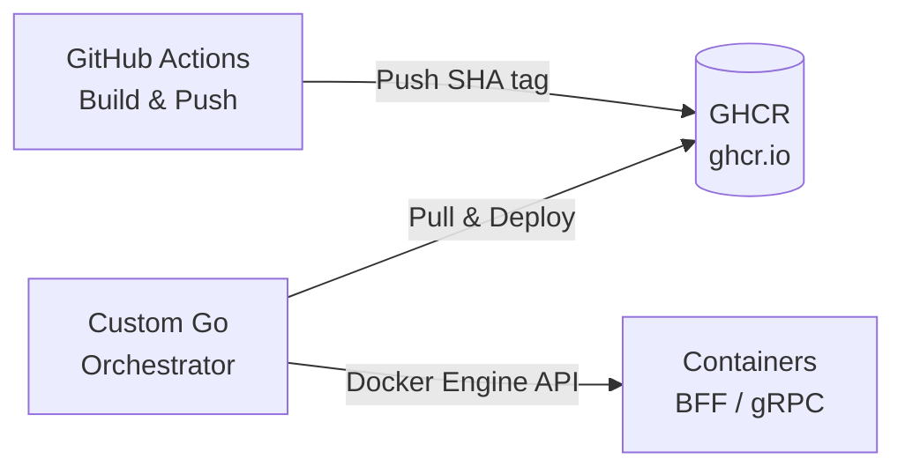

# hss-science System Architecture & AI Guidelines

This document defines the overall architecture, infrastructure, and implementation principles of the hss-science system.

When generating or refactoring code, AI agents must adhere to these foundational principles while **avoiding rigid formalism and continuously pursuing the most rational and elegant design possible.**

---

## 1. Core Philosophy & The Twelve-Factor App

This system is designed with scalability and team development in mind. At its foundation are:

* **Separation of Concerns**
* **The Twelve-Factor App methodology**

AI agents must strictly follow these principles and avoid excessive abstraction (e.g., heavy ORMs or meaningless layering).

### Stateless Processes (12-Factor: VI)

All application processes — especially BFFs — must be stateless.
Any data that must be shared or persisted must be stored in a database (Accounts service or respective domain services).

### Config in Environment (12-Factor: III)

All configuration must be provided via environment variables. Hardcoding credentials or environment-dependent values is strictly prohibited.

* Environment variables such as `ENV` (`development`, `staging`, `production`), `PORT`, `LOG_LEVEL`, etc., must be enumerated in `.env.example`.
* At startup, environment variables must be parsed.
* If required variables are missing, the application must **fail fast** (`fmt.Fprintf(os.Stderr, ...)` + `os.Exit(1)`).

### Disposability (12-Factor: IX)

Containers must start quickly and handle graceful shutdown properly upon receiving `SIGTERM`.

### Logs as Event Streams (12-Factor: XI)

Structured logging is mandatory.

* Use Go’s standard `log/slog`.
* Logs must always be written to standard output (`os.Stdout`).
* The default format is JSON (fallback to text format only when `ENV=development`).
* Logs must include contextual metadata such as:

  * `service` name
  * `trace_id` or `request_id`
    This ensures full request traceability.

---

## 2. Loose Coupling & Routing Boundaries (ABSOLUTE CONSTRAINT)

To ensure independent scalability and development across components, boundaries must be strictly enforced.

### Reverse Proxy (Caddy)

Responsible for TLS termination and routing.

* `/*` (root path): Serves frontend SPA static assets (built with Vite).
* `/api/*`: Reverse proxies to BFFs corresponding to each subdomain (e.g., `drive.hss-science.org`, `chat...`).

### BFF (Custom HTTP Server)

**Responsibilities:**

* HTTP request/response handling
* CORS
* Redirects
* Cookie-based session management

**Constraints:**

* `grpc-gateway` must not be used.
* Direct database access is strictly prohibited.

### Microservices (gRPC — `accounts`, `drive`, `chat`, etc.)

**Responsibilities:**

* Pure domain logic execution
* Data persistence

**Constraints:**

* Must not contain any HTTP or Cookie concepts.
* Authentication information (`internal_user_id`) must be received via `context`.

---

## 3. Infrastructure & Deployment

Conventional orchestration tools such as Kubernetes or Docker Compose are not used.
Instead, a **custom Go-based container orchestrator** directly operates the Docker Engine API to achieve simple and fully controlled operations.

### Image Management

* Use multi-stage builds.
* Image registry: GHCR (GitHub Packages).

### Tag Strategy

* Image tags must default to Git SHA hashes.
* The `latest` tag must only be updated upon explicit deployment instruction.



---

## 4. Schema-Driven Development & Contracts (ABSOLUTE CONSTRAINT)

Each component must depend only on **contracts (schemas)**, never on internal implementations of other components.

### External API (Frontend ⇔ BFF)

* Define **OpenAPI (YAML)** specifications under `api/openapi/`.
* Use tools such as `oapi-codegen` to autonomously generate Go code.

### Internal Communication (BFF ⇔ Microservices)

* Define **Protocol Buffers** under `api/proto/`.
* Generate gRPC code using tools such as `buf generate`.
* Do not include HTTP annotations (`google.api.http`).

### Instruction to AI Agents

Whenever a schema is defined or modified:

1. Execute code generation commands autonomously.
2. Implement code that satisfies the generated interfaces.

Schema generation must always precede implementation.

---

## 5. Testing Strategy (Decoupled Systems)

To prevent dependency hell at scale, **local full-system E2E testing (e.g., large `docker-compose up`) is strictly prohibited.**

Testing must be completed at each architectural layer independently.

```
        ┌─────────────┐
        │ Manual Test │  ← Smoke tests in staging/production
       ─┴─────────────┴─
      ┌──────────────────┐
      │ Integration Test │  ← Limited tests using testcontainers (DB/external deps)
     ─┴──────────────────┴─
    ┌────────────────────────┐
    │       Unit Test        │  ← Fast tests using mocks/stubs (primary focus)
    └────────────────────────┘
```

### Prohibited Practices

* Shared test databases
* Inter-test execution order dependencies

Each test must be completely independent.

* BFF layer tests must mock backend services.
* Microservice tests must not assume the existence of BFF.

---

## 6. Data Management

### Database per Service

Each gRPC service must have a completely independent PostgreSQL database (or schema).

* Direct access to another service’s database is strictly prohibited.
* Cross-service JOINs are strictly prohibited.

### Technology Selection

Heavy ORMs (e.g., GORM) should generally be avoided.

* Base approach: `database/sql` + `sqlx`
* If a more type-safe tool (e.g., `sqlc`) is more appropriate, AI agents should proactively propose and adopt it.

---

## 7. Authentication & Authorization Responsibilities

See `docs/AUTH.md` for details.

---

## 8. Autonomous AI Development Cycle & Implementation Guidelines

There is no obligation to preserve existing implementations or backward compatibility.

As long as the core philosophy is respected, AI agents should prioritize the most refined and ideal implementation they can conceive. Scrap-and-build refactoring is fully permitted.

### 1. Schema First & Generation

Define or modify specifications first.
Execute code generation autonomously before beginning implementation.

### 2. Practical & Isolated Testing

Do not be dogmatic about TDD.
Use mocks and database containers pragmatically to create tests that can validate behavior independently of other components.

### 3. Autonomous Refactoring (Self-Correction)

Do not fear breaking changes.
If a more elegant domain model or a more efficient implementation exists, refactor autonomously without seeking permission.