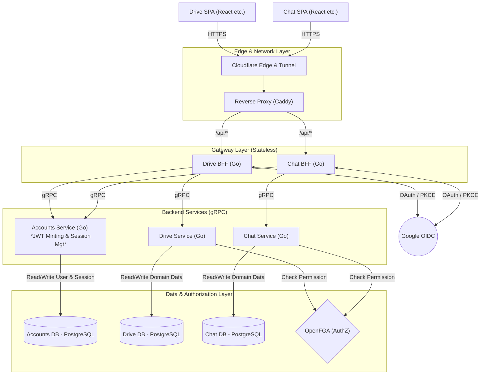
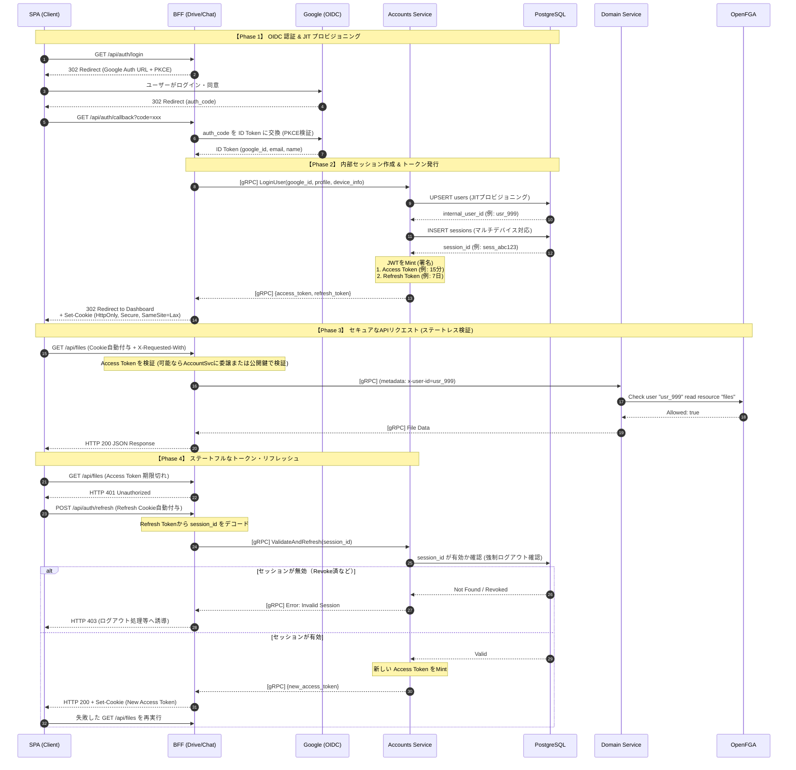

# HSS Science Platform - 認証・認可アーキテクチャ

## 1. 設計思想と基本方針

本プラットフォームは、エンタープライズ要件を満たす堅牢なセキュリティと、開発・運用コストの最適化を両立させるため、以下の「3つの柱」に基づく設計を推奨します。

### 1.1. アーキテクチャの分離と境界

システム全体の結合度を下げ、障害や脆弱性の影響範囲を最小化します。

* **関心の分離 (BFFとバックエンドの責務分割)**
* **方針:** BFF（API Gateway）はリクエストのルーティングとCookieの読み書きに特化させます。ビジネスロジックの処理やトークンの発行（秘密鍵の管理）は、安全な内部ネットワークにある `Account Service` に隠蔽します。
* **目的:** 外部からの攻撃に晒されやすいBFF層から重要な状態や鍵を排除し、システムを堅牢にするため。
* **セキュリティ境界の分離 (ドメイン単位のゼロトラスト)**
* **方針:** DriveとChatなど、異なるサービス（サブドメイン）間でCookie（トークン）を共有せず、それぞれ独立したセッションとして扱います。
* **目的:** 万が一、あるフロントエンド（例: Chat）に脆弱性があった場合でも、その被害が他のサービス（例: Drive）に波及しないようにするため。

### 1.2. 認証・認可

ユーザーの利便性を保ちつつ、管理リスクとDB負荷を極限まで低減します。

* **パスワードレスの推進 (外部IdPへの委譲)**
* **方針:** 自システム内でユーザーのパスワードを保持・管理せず、認証（AuthN）プロセスはすべてGoogle OIDC等の外部IdPに委譲します。
* **目的:** パスワードのハッシュ化、パスワードリセット等の実装コストを削減し、情報漏洩リスクを根本から回避するため。

* **ハイブリッド・トークン戦略 (パフォーマンスと制御の両立)**
* **方針:** 短寿命の **Access Token（ステートレス）** と、長寿命の **Refresh Token（ステートフル・DB管理）** を組み合わせて使用します。
* **目的:** 頻繁に呼ばれるAPIではDBアクセスをゼロにして高速応答を実現しつつ、「スマホを紛失した際の強制ログアウト」といった厳格なセッション管理を可能にするため。

### 1.3. セッションと通信の保護

SPA（Single Page Application）特有の脆弱性に対して、多層的な防御を構築します。

* **実用的なセッション管理 (XSS / CSRF の多層防御)**
* **方針:** 1. トークンはすべて `HttpOnly` Cookieとして発行し、JavaScriptからの読み取りをブロックします。
2. Cookie属性は利便性と安全性のバランスを取り `SameSite=Lax` を基本とします。
3. それを補完するため、SPAからのAPIリクエストには特定のカスタムヘッダー（例: `X-Requested-With`）の付与を必須とし、BFF側で検証します。
* **目的:** XSSによるトークン奪取リスクを完全に排除しつつ、CORSの仕組みを利用してCSRF攻撃を効果的に無効化するため。

---

## 2. システム・コンポーネント構成

ネットワークのエッジから内部DBまでの標準的なデータの流れとコンポーネントの配置想定です。

---

## 3. コンポーネントの責務定義と推奨技術

実装を担当するAIエージェントおよび開発者は、重厚なフレームワークやORMを避け、Go言語本来のシンプルさとパフォーマンスを活かすため、以下の責務と技術スタック（軽量ライブラリ）を基準に実装を進めてください。

| コンポーネント | 役割と責務 | 推奨ライブラリ / 技術 |
| --- | --- | --- |
| **SPA (Client)** | UI描画。トークンの中身はパースせず、リクエスト時に自動付与されるCookieに依存する。 | React, Zustand など |
| **Cloudflare / Proxy** | SSL終端、DDoS防御、内部ネットワークへの安全なトンネリング。 | Cloudflare Tunnel, Caddy |
| **BFF (Gateway)** | OIDCコールバック処理、SPAへの `Set-Cookie` (`HttpOnly`, `SameSite=Lax`)、gRPCメタデータ変換、CSRFヘッダー検証。秘密鍵は保持しない。 | ルーティングとミドルウェア管理には `go-chi/chi` を使用し、標準の `net/http` に準拠する。 OIDC/PKCE実装には `golang.org/x/oauth2` および `coreos/go-oidc/v3` を推奨。 |
| **Accounts Service** | システムのIdentity管理。Google IDと内部IDの紐付け、セッション管理、JWTの署名と検証。 | Go, `grpc-go`, `golang-jwt/jwt/v5` **※ORMは不使用。** DB操作は生SQLを基本とし、ボイラープレート削減のため `database/sql` + `jmoiron/sqlx` (ドライバは `pgx` 等) を使用する。 |
| **Domain Services** | BFFからの内部ID (`x-user-id`) を信頼し、各ドメインのビジネスロジックを実行する。 | Go, `grpc-go`, `jmoiron/sqlx` (DBアクセスが必要な場合) |
| **OpenFGA / DB** | ユーザーとセッションの永続化、および各ドメインのリソースに対するアクセス権限の判定。 | PostgreSQL, OpenFGA Go SDK |

---

## 4. 認証・認可・セッション管理フロー

JWTの発行責務をAccount Serviceに移譲し、セキュリティと柔軟性を両立させたシーケンスの例です。

---

## 5. 脅威モデリングとセキュリティ対策

実装時は、以下の脅威を想定し、適切な対策を組み込むことを推奨します。

| 攻撃手法 | 推奨される防御策 |
| --- | --- |
| **XSS (クロスサイトスクリプティング)** | トークンを `HttpOnly` 属性のCookieに格納し、JSからの意図しない読み取りを制限する。 |
| **CSRF (クロスサイトリクエストフォージェリ)** | Cookieに `SameSite=Lax` を付与。さらにBFFでカスタムヘッダー（`X-Requested-With` など）の存在を検証し、単純なForm送信等による攻撃を防ぐ。 |
| **OAuth 認可コードの横取り** | OIDCプロバイダーとの通信時に **PKCE (Proof Key for Code Exchange)** の実装を基本とする。 |
| **トークン漏洩時の被害拡大** | Access Tokenの有効期限を短く（例: 15分〜1時間程度）設定し、リスクウィンドウを最小化する。 |
| **デバイス紛失時の不正アクセス** | Account ServiceでRefresh TokenをDB管理し、必要に応じて特定のセッション（`session_id`）をRevoke（無効化）できる仕組みを用意する。 |
| **SPAのトークンリフレッシュ競合** | クライアント側（Axios Interceptor等）で排他制御キューを実装し、複数API発火による401エラーの連鎖と無駄なリフレッシュ要求を防ぐ。 |