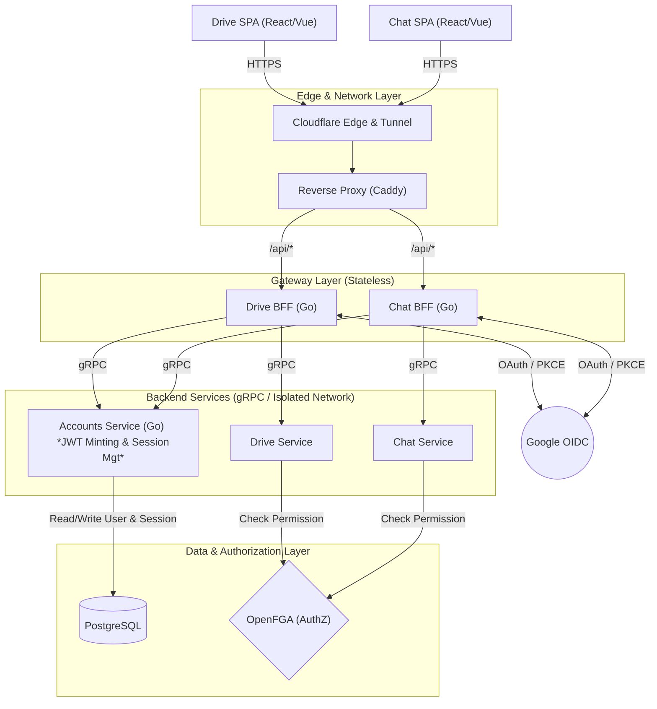
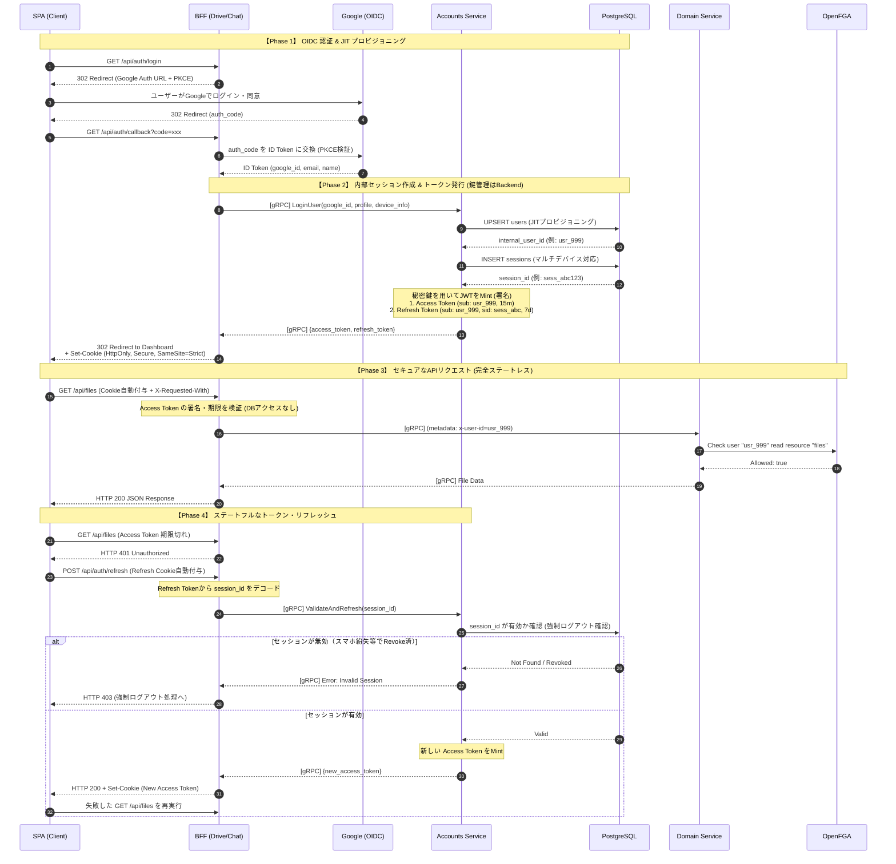

# HSS Science Platform - 認証・認可アーキテクチャ設計書

## 1. 設計思想と基本方針 (Design Philosophy)

本プラットフォームは、最新のエンタープライズ・セキュリティのベストプラクティスに基づき、以下の基本方針で設計されています。

* **完全なパスワードレス (Passwordless):** 自システムでパスワードを管理せず、認証（AuthN）はすべてGoogle OIDCに委譲する。
* **関心の分離 (Separation of Concerns):** BFFはルーティングとセッション（Cookie）管理に徹し、ビジネスロジックとトークン発行（鍵管理）はバックエンドの `Account Service` に隠蔽する。
* **強固なセッション管理:** XSS攻撃を無効化する `HttpOnly` Cookieと、CSRFを防ぐ `SameSite=Strict` + カスタムヘッダー検証を採用する。
* **ハイブリッド・トークン:** 普段のAPIはDBアクセスゼロの「ステートレス（Access Token）」で高速化しつつ、デバイスごとの強制ログアウトを可能にする「ステートフル（Refresh Token）」なセッション管理を両立する。
* **ドメインごとのセキュリティ境界:** DriveとChatで完全に独立したCookieを発行し、一方の脆弱性が他方に波及しないゼロトラスト構造とする。

---

## 2. システム・コンポーネント構成 (Architecture Diagram)

ネットワークのエッジ（境界）から最深部のDBまでのデータの流れとコンポーネントの配置です。

---

## 3. コンポーネントの責務定義

| コンポーネント | 役割と責務 |
| --- | --- |
| **SPA (Client)** | UIの描画。トークンの存在（中身）は一切知らず、リクエスト時に自動付与されるCookieに依存する。 |
| **Cloudflare / Caddy** | SSL終端、DDoS防御、内部ネットワーク（VPC等）への安全なトンネリング。 |
| **BFF (Gateway)** | Google OIDCのコールバック処理。SPAへの `Set-Cookie`（`HttpOnly`, `SameSite=Strict`）。gRPC通信時の `x-user-id` メタデータ付与。CSRFヘッダーの検証。**※秘密鍵は持たない。** |
| **Accounts Service** | システムの「IdP兼ユーザー管理」の心臓部。Google IDからの内部ID (`usr_xxx`) の生成（JITプロビジョニング）。デバイスごとのセッションID管理。**JWT（Access/Refresh）の署名と発行。** |
| **Domain Services** | BFFから渡された内部ID (`x-user-id`) を絶対的に信頼し、ビジネスロジックを実行する。 |
| **OpenFGA / DB** | DBは全ユーザーとセッションの唯一のソース（Single Source of Truth）。OpenFGAはドメインサービスからの認可（ファイルアクセス権など）を判定する。 |

---

## 4. 認証・認可・セッション管理フロー (Sequence Diagram)

JWTの発行責務をAccount Serviceに移譲した、最も堅牢なシーケンスです。

---

## 5. 脅威モデリングとセキュリティ対策 (Security Mitigations)

本アーキテクチャは、Webアプリケーションにおける主要な攻撃ベクタに対して設計レベルで対策を講じています。

| 攻撃手法 | 本システムでの防御策 |
| --- | --- |
| **XSS (クロスサイトスクリプティング)** | すべてのトークンを `HttpOnly` 属性のCookieに格納。JavaScript（`document.cookie` 等）からの読み取りをブラウザレベルで完全にブロック。 |
| **CSRF (クロスサイトリクエストフォージェリ)** | Cookieに `SameSite=Strict` を付与し、別ドメインからのリクエスト送信を遮断。さらにBFFでカスタムヘッダー（`X-Requested-With` 等）を要求し、通常のForm送信等による攻撃を無効化。 |
| **OAuth 認可コードの横取り** | Google OIDCとの通信時に **PKCE (Proof Key for Code Exchange)** を必須化。 |
| **トークン漏洩時の被害拡大** | Access Tokenの寿命を15分と短く設定。 |
| **デバイス紛失時の不正アクセス** | Account ServiceとDBによるステートフルなRefresh Token管理。別の端末から対象セッション（`session_id`）をDB上でRevoke（無効化）することで、最長15分以内に強制ログアウトを完了させる。 |
| **内部ネットワークでのなりすまし** | gRPCポートは内部VPCのみに解放し、インターネットから直接 `AccountSvc` や `DomainSvc` を叩けないよう Cloudflare Tunnel と Docker Network で厳格に隔離。 |
| **SPAのトークンリフレッシュ競合** | クライアント側（Axios Interceptor等）で「Refresh Lock（排他制御キュー）」を実装し、複数API同時発火による無駄な401エラー連鎖を防止。 |