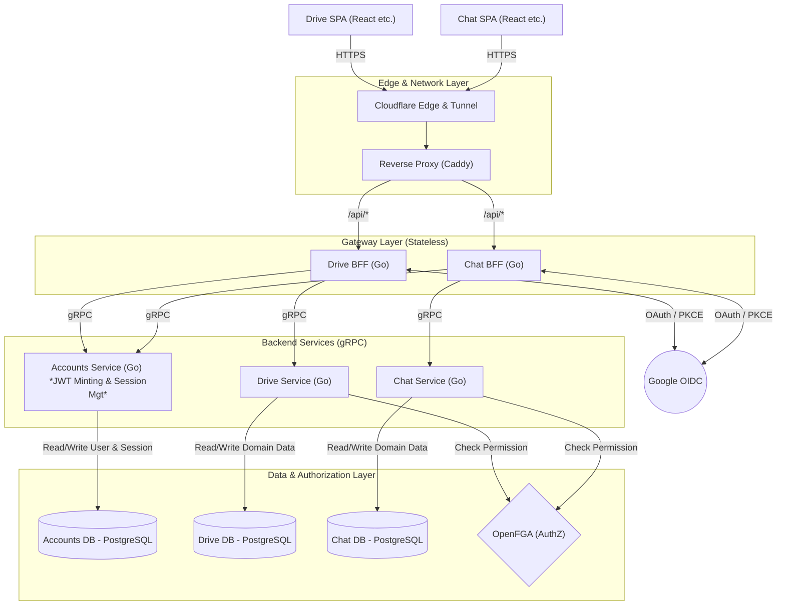

# HSS Science Platform – Authentication & Authorization Architecture

## 1. Design Philosophy & Core Principles

To balance enterprise-grade security with optimized development and operational cost, this platform adopts an architecture based on the following three pillars.

---

### 1.1 Architectural Separation & Boundary Enforcement

The system is designed to minimize coupling and reduce the blast radius of failures or vulnerabilities.

#### Separation of Concerns (BFF vs Backend Responsibilities)

**Policy:**
The BFF (API Gateway) is strictly responsible for request routing and Cookie read/write operations.
Business logic processing and token issuance (including private key management) are encapsulated within the `Accounts Service`, which resides in a secure internal network.

**Objective:**
To remove sensitive state and key material from the externally exposed BFF layer and harden the overall system.

#### Security Boundary Isolation (Zero-Trust by Domain)

**Policy:**
Cookies (tokens) must not be shared across different services/subdomains (e.g., Drive and Chat). Each service maintains an independent session.

**Objective:**
If a vulnerability exists in one frontend (e.g., Chat), its impact must not propagate to other services (e.g., Drive).

---

### 1.2 Authentication & Authorization

The system preserves user convenience while minimizing management risk and database load.

#### Passwordless Strategy (Delegation to External IdP)

**Policy:**
The system does not store or manage user passwords internally.
Authentication (AuthN) is fully delegated to external Identity Providers such as Google OIDC.

**Objective:**
To eliminate password hashing, reset flows, and associated implementation costs, while fundamentally reducing credential leakage risk.

---

#### Hybrid Token Strategy (Performance + Control)

**Policy:**
Use a combination of:

* Short-lived **Access Tokens** (stateless)
* Long-lived **Refresh Tokens** (stateful, managed in DB)

**Objective:**
Enable zero-DB-access for frequently invoked APIs while retaining strict session control capabilities (e.g., forced logout after device loss).

---

### 1.3 Session & Communication Protection

To address SPA-specific vulnerabilities, a layered defense model is adopted.

#### Practical Session Management (Multi-layer XSS / CSRF Defense)

**Policy:**

1. All tokens must be issued as `HttpOnly` Cookies to prevent JavaScript access.
2. Cookie attributes default to `SameSite=Lax`, balancing usability and security.
3. All SPA API requests must include a custom header (e.g., `X-Requested-With`), which the BFF validates.

**Objective:**
To eliminate token theft via XSS while leveraging CORS behavior to effectively mitigate CSRF attacks.

---

## 2. System Component Topology

The following illustrates the standard data flow from the network edge to internal databases.



---

## 3. Component Responsibilities & Recommended Technologies

AI agents and developers must avoid heavyweight frameworks and ORMs.
Leverage Go’s native simplicity and performance using lightweight libraries.

| Component              | Role & Responsibility                                                                                                                                      | Recommended Stack                                                                                                        |
| ---------------------- | ---------------------------------------------------------------------------------------------------------------------------------------------------------- | ------------------------------------------------------------------------------------------------------------------------ |
| **SPA (Client)**       | Renders UI. Does not parse token contents. Relies on automatically attached Cookies.                                                                       | React, Zustand                                                                                                           |
| **Cloudflare / Proxy** | SSL termination, DDoS protection, secure tunneling to internal network.                                                                                    | Cloudflare Tunnel, Caddy                                                                                                 |
| **BFF (Gateway)**      | OIDC callback handling, `Set-Cookie` issuance (`HttpOnly`, `SameSite=Lax`), gRPC metadata translation, CSRF header validation. Must not hold private keys. | Routing & middleware via `go-chi/chi` on top of `net/http`. OIDC/PKCE via `golang.org/x/oauth2` and `coreos/go-oidc/v3`. |
| **Accounts Service**   | Identity management. Mapping Google IDs to internal IDs. Session management. JWT signing and verification.                                                 | Go, `grpc-go`, `golang-jwt/jwt/v5`. **No ORM.** Use raw SQL with `database/sql` + `jmoiron/sqlx` (driver: `pgx`, etc.).  |
| **Domain Services**    | Trust internal user ID (`x-user-id`) from BFF and execute domain business logic.                                                                           | Go, `grpc-go`, `jmoiron/sqlx` (if DB required)                                                                           |
| **OpenFGA / DB**       | Persistence of users and sessions; authorization checks for domain resources.                                                                              | PostgreSQL, OpenFGA Go SDK                                                                                               |

---

## 4. Authentication, Authorization & Session Flow

Token issuance is delegated to the Accounts Service to ensure security and flexibility.

```mermaid
sequenceDiagram
    autonumber

    participant SPA as SPA (Client)
    participant BFF as BFF (Drive/Chat)
    participant Google as Google (OIDC)
    participant AccountSvc as Accounts Service
    participant DB as PostgreSQL
    participant Backend as Domain Service
    participant AuthZ as OpenFGA

    Note over SPA,DB: Phase 1 – OIDC Authentication & JIT Provisioning

    SPA->>BFF: GET /api/auth/login
    BFF-->>SPA: 302 Redirect (Google Auth URL + PKCE)
    SPA->>Google: User login & consent
    Google-->>SPA: 302 Redirect (auth_code)

    SPA->>BFF: GET /api/auth/callback?code=xxx
    BFF->>Google: Exchange auth_code for ID Token (PKCE validation)
    Google-->>BFF: ID Token (google_id, email, name)

    Note over BFF,DB: Phase 2 – Internal Session Creation & Token Issuance
    
    BFF->>AccountSvc: [gRPC] LoginUser(google_id, profile, device_info)
    
    AccountSvc->>DB: UPSERT users (JIT provisioning)
    DB-->>AccountSvc: internal_user_id (e.g., usr_999)
    
    AccountSvc->>DB: INSERT sessions (multi-device support)
    DB-->>AccountSvc: session_id (e.g., sess_abc123)
    
    Note over AccountSvc:
        Mint JWTs (signed)
        1. Access Token (e.g., 15 minutes)
        2. Refresh Token (e.g., 7 days)
    
    AccountSvc-->>BFF: [gRPC] {access_token, refresh_token}

    BFF-->>SPA:
        302 Redirect to Dashboard
        + Set-Cookie (HttpOnly, Secure, SameSite=Lax)

    Note over SPA,AuthZ: Phase 3 – Secure API Request (Stateless Validation)

    SPA->>BFF: GET /api/files (Cookie auto-attached + X-Requested-With)
    Note over BFF:
        Validate Access Token
        (either via Accounts Service or public key verification)
    
    BFF->>Backend: [gRPC] (metadata: x-user-id=usr_999)
    Backend->>AuthZ: Check permission: user "usr_999" read "files"
    AuthZ-->>Backend: Allowed: true
    Backend-->>BFF: [gRPC] File Data
    BFF-->>SPA: HTTP 200 JSON

    Note over SPA,AccountSvc: Phase 4 – Stateful Token Refresh

    SPA->>BFF: GET /api/files (Access Token expired)
    BFF-->>SPA: HTTP 401 Unauthorized

    SPA->>BFF: POST /api/auth/refresh (Refresh Cookie auto-attached)
    Note over BFF:
        Decode session_id from Refresh Token
    
    BFF->>AccountSvc: [gRPC] ValidateAndRefresh(session_id)
    AccountSvc->>DB: Verify session validity (forced logout check)
    
    alt Session invalid (revoked)
        DB-->>AccountSvc: Not Found / Revoked
        AccountSvc-->>BFF: Error: Invalid Session
        BFF-->>SPA: HTTP 403 (trigger logout)
    else Session valid
        DB-->>AccountSvc: Valid
        Note over AccountSvc: Mint new Access Token
        AccountSvc-->>BFF: {new_access_token}
        BFF-->>SPA: HTTP 200 + Set-Cookie (New Access Token)
        SPA->>BFF: Retry failed GET /api/files
    end
```

---

## 5. Threat Modeling & Security Countermeasures

The following threats must be considered and mitigated during implementation:

| Attack Vector                             | Recommended Defense                                                                                                               |
| ----------------------------------------- | --------------------------------------------------------------------------------------------------------------------------------- |
| **XSS (Cross-Site Scripting)**            | Store tokens in `HttpOnly` Cookies to prevent unintended JavaScript access.                                                       |
| **CSRF (Cross-Site Request Forgery)**     | Use `SameSite=Lax` Cookies and require custom headers (`X-Requested-With`) validated by the BFF.                                  |
| **OAuth Authorization Code Interception** | Enforce PKCE (Proof Key for Code Exchange) in all OIDC flows.                                                                     |
| **Token Leakage Impact**                  | Use short Access Token lifetimes (e.g., 15–60 minutes) to minimize risk window.                                                   |
| **Unauthorized Access After Device Loss** | Store Refresh Tokens in DB via Accounts Service and support revocation by `session_id`.                                           |
| **SPA Token Refresh Race Conditions**     | Implement client-side request queueing (e.g., Axios interceptor lock) to prevent cascading 401 loops and redundant refresh calls. |

