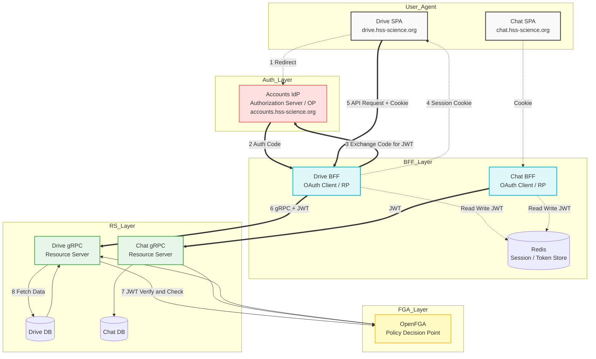

```mermaid
flowchart TB

    %% ユーザー環境
    subgraph User_Agent
        direction TB
        SPA_Drive["Drive SPA<br/>drive.hss-science.org"]
        SPA_Chat["Chat SPA<br/>chat.hss-science.org"]
    end

    %% 認証基盤
    subgraph Auth_Layer
        IdP["Accounts IdP<br/>Authorization Server / OP<br/>accounts.hss-science.org"]
    end

    %% BFF層
    subgraph BFF_Layer
        direction TB
        Drive_BFF["Drive BFF<br/>OAuth Client / RP"]
        Chat_BFF["Chat BFF<br/>OAuth Client / RP"]
        Redis[("Redis<br/>Session / Token Store")]

        Drive_BFF -.->|Read Write JWT| Redis
        Chat_BFF -.->|Read Write JWT| Redis
    end

    %% バックエンド層
    subgraph RS_Layer
        direction TB
        Drive_gRPC["Drive gRPC<br/>Resource Server"]
        Chat_gRPC["Chat gRPC<br/>Resource Server"]
        DB_Drive[("Drive DB")]
        DB_Chat[("Chat DB")]
    end

    %% 認可基盤
    subgraph FGA_Layer
        OpenFGA["OpenFGA<br/>Policy Decision Point"]
    end

    %% --- Driveログインフロー ---
    SPA_Drive -.->|1 Redirect| IdP
    IdP ==> |2 Auth Code| Drive_BFF
    Drive_BFF ==> |3 Exchange Code for JWT| IdP

    %% セッション管理
    Drive_BFF -.->|4 Session Cookie| SPA_Drive

    %% APIリクエスト
    SPA_Drive ==> |5 API Request + Cookie| Drive_BFF
    Drive_BFF ==> |6 gRPC + JWT| Drive_gRPC

    %% 認可・DB
    Drive_gRPC -->|7 JWT Verify and Check| OpenFGA
    OpenFGA --> Drive_gRPC
    Drive_gRPC -->|8 Fetch Data| DB_Drive
    DB_Drive --> Drive_gRPC

    %% Chat簡易フロー
    SPA_Chat -.->|Cookie| Chat_BFF
    Chat_BFF ==> |JWT| Chat_gRPC
    Chat_gRPC --> OpenFGA
    Chat_gRPC --> DB_Chat

    %% スタイル
    classDef browser fill:#f9f9f9,stroke:#333,stroke-width:2px;
    classDef idp fill:#ffe0e0,stroke:#ff6666,stroke-width:2px;
    classDef bff fill:#e0f7fa,stroke:#00bcd4,stroke-width:2px;
    classDef rs fill:#e8f5e9,stroke:#4caf50,stroke-width:2px;
    classDef fga fill:#fff9c4,stroke:#fbc02d,stroke-width:2px;

    class SPA_Drive,SPA_Chat browser;
    class IdP idp;
    class Drive_BFF,Chat_BFF bff;
    class Drive_gRPC,Chat_gRPC rs;
    class OpenFGA fga;
```